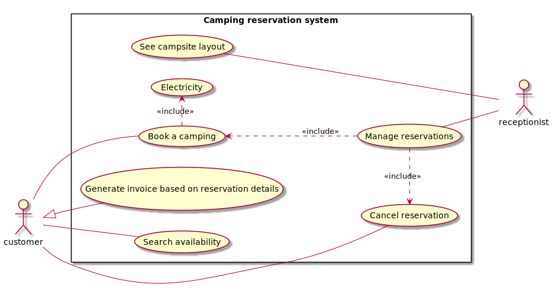

# Követelmény specifikáció

## Jelenlegi helyzet

Ha foglalás történik, kézzel írja le a recepciós a beérkezett foglalások időpontját és az adott létszámot, esetleges igényeket.
Problémát jelentenek az esetleges elírások, hibák, és a nehéz visszakeresése az adatoknak.

## Vágyálomrendszer

Az új rendszernek köszönhetően gyorsabban, kevesebb hibával képesek a recepciósok a foglalásokat felvinni.
Az adatok könnyen elérhetőek, jól rendszerezettek.
A rendszer mindig a legfrissebb adatokat mutatja igényes, könnyen érthető kezelői felületen.

## Igényelt üzleti folyamatok modellje

## Követelménylista

|ID|Név|Kifejtés|
|---|---|---|
|K1|Adatbázis|A weboldal adatbázisból kell a foglalásokkal kapcsolatos adatokat tárolni, és módosítani, lekérdezni|
|K2|Adatok lekérdezése|A recepciós lekérdezéseket végezhet a táborhelyekkel kapcsolatos adatokról|
|K3|Vásárló adatainak rögzítése|A recepciós felvihet adatokat a vásárlókról|
|K4|Táborhely bérbeadás|A recepciós táborhelyeket kölcsönözhet ki a vásárlóknak|
|K5|Áram bérbeadás|A recepciós áramot kölcsönözhet ki a vásárlóknak|
|K6|Oldal adatainak frissítése|Bizonyos időintervallumonként a felületnek frissülnie kell|
|K7|Számla|A rendszer számlát generál a vásárló távozásakor|
|K8|Design|A recepciosnak látnia kell a táborhely alaprajzát az oldalon|

## Adatszerkezetek körvonalazása

### Kemping slot leírása

Egy kemping slot-nak van id-ja amivel azonosítjuk, van két koordinátája ami alapján tudjuk számítani, hogy hol van és mekkora a területe, erre példa a következő kép.

Az árát az alapárból és a területből számíthatjuk. 
Van egy bool mezője ami a foglaltságát jellemzi.
Ezeken kívül tárolunk egy leírást melyben a slot jellegzetességeit írjuk le, mint például (van ott egy tűzrakóhely).

### Use case-ek leírása

#### Login

A login azért van bevezetve, hogy egyszerre több recepciós is tudjon dolgozni a rendszerben és hogy vissza lehessen követni, hogy melyik recepciós adta ki az adott slot-ot.

##### Kérés

Felhasználónév és jelszó párost kap.

##### Válasz

Visszajelzés a bejelentkezés sikerességéről.

#### Foglalás

##### Kérés

Kap egy user-t, egy slot-ot és a foglalás időintervallumát.

##### Válasz

Visszajelzés a foglalás sikerességéről.

#### Áram bérlés

Egy slot-hoz bérelhető áram egységes felárért.

##### Kérés

Egy user-t kap csak.

##### Válasz

Visszajelzés a sikerességről.

#### Foglalás lemondása

##### Kérés

Kap egy foglalást.

##### Válasz

Válasz a lemondás sikerességéről.

#### Elérhetőség lekérdezése a slot-okról

##### Kérés

##### Válasz

Vissza adja az összes slot-ot.

#### Adatok frissítése

Azért szükséges, hogy ha esetleg egy másik recepciós felvitt egy adatot akkor frissüljön.
Adott időközönként frissül, illetve egy foglalás indításakor, lemondás után is.

#### Checkout

##### Kérés

Kap egy foglalást.

##### Válasz

Sikeres vagy sikertelen ki csekkolás.

#### Nyugta generálása 

##### Kérés

Kap egy foglalást

##### Válasz

Vissza ad egy text fájlt.
